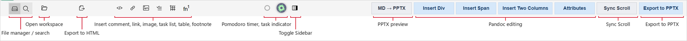
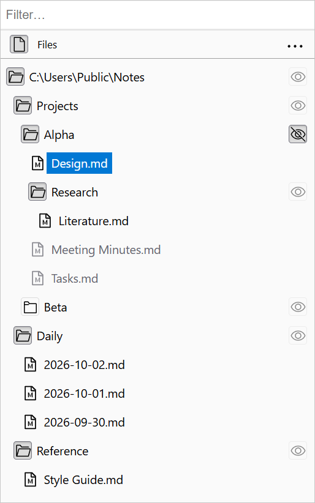
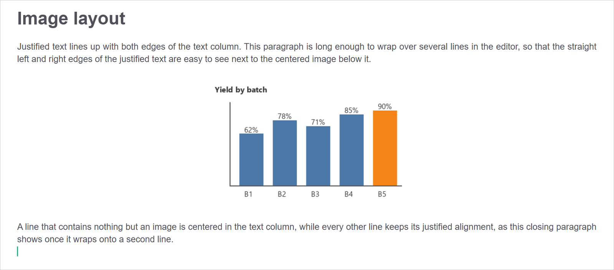
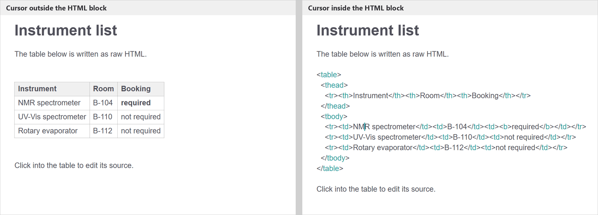
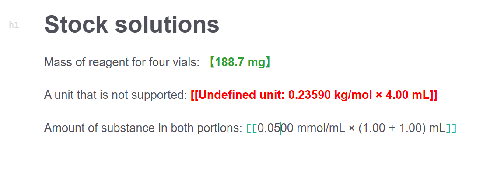
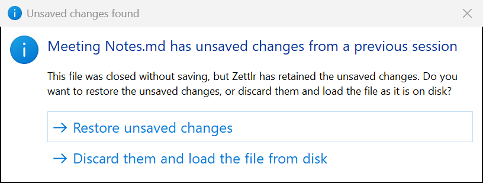
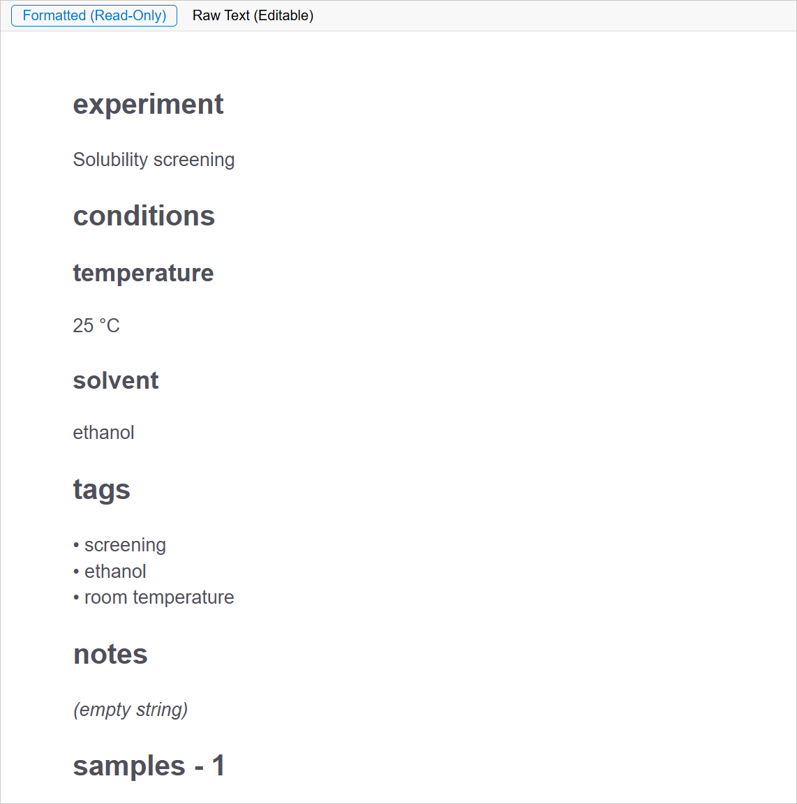
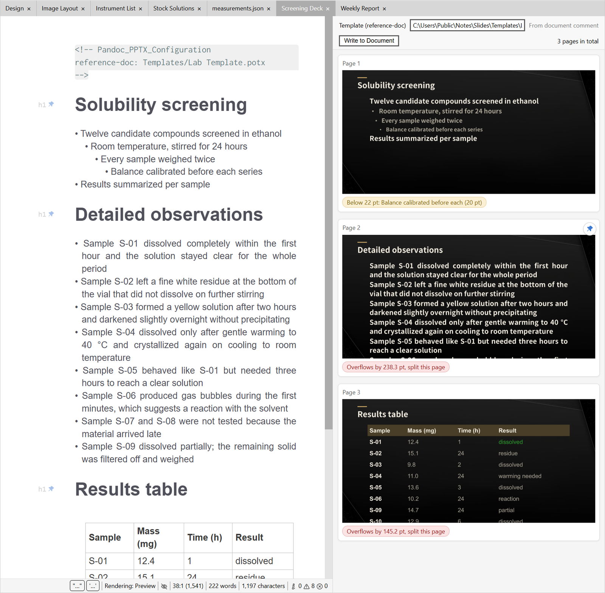
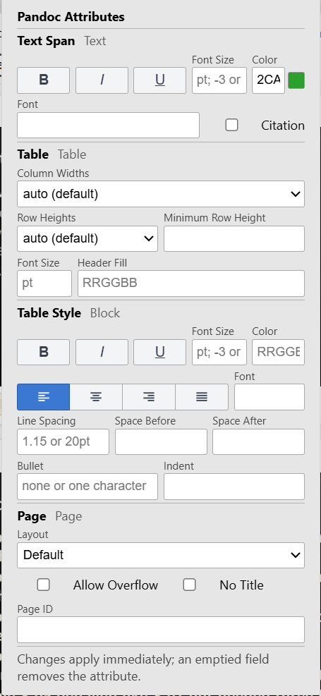
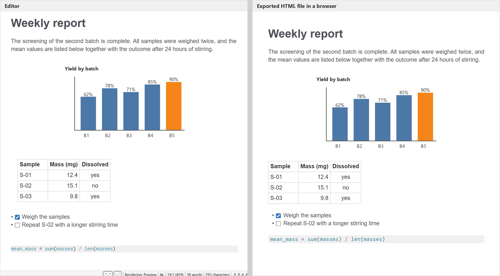

# Zettlr-LYH User Manual

Zettlr-LYH is a personal branch of the open-source Markdown editor Zettlr. It keeps every Zettlr feature and adds its own: a Files section organized as an opening-history tree, a live Pandoc PPTX slide preview with export, attribute editing for Pandoc slides, a standalone Export to HTML, calculation of bracketed physical-quantity formulas, a JSON and JSON Lines viewer, a cache of unsaved changes that survives restarts, in-place rendering of HTML, and various editing and display adjustments. This manual covers only what differs from Zettlr; everything else behaves as in Zettlr and is documented at https://docs.zettlr.com.

## Installation and running

### Requirements

- Windows. The branch is used and tested on Windows only; the PPTX features depend on Windows-only components.
- Node.js with corepack. Yarn is supplied through corepack and does not need a separate install; every Yarn command below is written as `corepack yarn …`.
- The source folder of this repository.

### Installing and starting

Zettlr-LYH runs from its source folder in development mode; there is no installer.

1. Open a terminal in the repository folder.
2. Run `corepack yarn install` once to install the dependencies.
3. Run `corepack yarn start`. The program compiles and then opens its main window. Keep the terminal open while you work; closing it ends the program.

The development server listens on port 3000. That port must be free when you start the program, and it must not be changed: with any other port, every reload of the interface opens a new tab in the system browser.

### Where settings and data are kept

The running instance stores its settings and data in `resources\test-cfg` inside the repository folder, not in the usual `%APPDATA%\Zettlr`. The configuration file is `resources\test-cfg\config.json`; the cache of unsaved changes and the PPTX preview cache are in the same data folder.

Do not edit `config.json` by hand while the program is running. The program holds the configuration in memory and writes the whole file back about one second after any setting changes, silently overwriting manual edits. Close the program first, edit the file, then start the program again.

### Running beside an installed Zettlr

Zettlr-LYH can run at the same time as an installed official Zettlr. It uses its own data folder, and on Windows its windows form their own taskbar group. When started from the source folder, the window carries the Zettlr application icon. The last item of the Help menu, the greyed-out entry "LYH's Unofficial Build", identifies this branch.

### Things not to do while the program runs

- Do not start a second `corepack yarn start` in the same repository folder.
- Do not run any packaging or build command in the repository folder. The running instance is served from the same folder, and a build replaces the files it uses, breaking it on the spot.

### Additional requirements for the PPTX features

The Pandoc PPTX preview and Export to PPTX need the following on the same computer. Everything else in Zettlr-LYH works without them.

- Desktop Microsoft PowerPoint for Windows. The preview drives an invisible PowerPoint instance to render slide images and measure text overflow.
- Anaconda Python 3.13, installed at the fixed location the program expects, with the `pywin32` and `python-pptx` packages.
- pandoc.
- The external conversion script `%USERPROFILE%\.claude\skills\PPT-Maker-NotesInTheScales-Pandoc\scripts\Convert_Markdown_Deck.py` together with the Markdown-to-PPTX renderer it uses.
- The default PowerPoint template (`.potx`) at the fixed location that the conversion script also uses. A document may name a different template; see "Choosing a template" below.

## Opening files from Windows Explorer

The small launcher program `Zettlr_LYH.exe` opens Markdown files from Windows Explorer directly in Zettlr-LYH. It lives in the repository folder but is a local helper and is not part of the published repository content. To use it, choose "Open with" → "Choose another app" on a Markdown file in Explorer and select `Zettlr_LYH.exe` (optionally as the default app for that file type).

When you open one or more files through the launcher:

- If Zettlr-LYH is already running, the files open in the running window. Opening the launcher without a file brings the running window to the front.
- If Zettlr-LYH is not running, the launcher opens a console window that runs `corepack yarn start` in the repository folder, and the files open once the program has finished starting. If starting fails, the console window stays open so you can read the error.
- If another launcher is already starting the program, or port 3000 is already in use, the launcher waits and retries every two seconds, for up to five minutes. If the program still cannot be reached, it shows an error box titled "Zettlr_LYH launcher".

Files that arrive while the program is still starting are held and opened as soon as startup finishes.

## The toolbar



The toolbar when a Markdown document is open. MD → PPTX and Sync Scroll are greyed out because the preview and synchronized scrolling are off. The light-blue buttons perform actions.

From left to right, the toolbar holds the following controls. Text buttons are at least 100 pixels wide; icon buttons are 28 × 28 pixels.

| Control | Kind | What it does |
|---|---|---|
| File manager / global search | Icon buttons | As in Zettlr. |
| Open workspace… | Icon button | As in Zettlr. |
| Export (tooltip "Export to HTML") | Icon button | When the active file is a Markdown file, exports it immediately to a standalone HTML file without a dialog (see "Export to HTML"). For any other file, opens Zettlr's Export dialog. |
| Insert comment, Insert link, Insert image, Insert task list, Insert table, Insert footnote | Icon buttons | As in Zettlr; each can be hidden in the preferences. |
| Pomodoro timer and the long-running-task indicator | Indicators | As in Zettlr. |
| Toggle Sidebar | Icon button | As in Zettlr. |
| MD → PPTX | Toggle text button | Opens or closes the Pandoc PPTX preview for the active Markdown document. Grey when off, green when the preview of the current document is open. Has no effect on other file types. |
| Insert Div | Text button | Opens a small dialog that inserts a Pandoc fenced div. |
| Insert Span | Text button | Opens a small dialog that inserts a Pandoc bracketed span. |
| Insert Two Columns | Text button | Splits the selected lines into a two-column fenced div for slides; tooltip "Split the selection into a two-column fenced div for slides (text on the left, image lines on the right)". |
| Attributes | Toggle text button | Opens or closes the Pandoc Attributes panel; green while the panel is open. |
| Sync Scroll | Toggle text button | Turns synchronized scrolling between the editor and the PPTX preview on or off; grey when off, green when on. |
| Export to PPTX | Text button | Saves the document if needed and converts it to a PowerPoint file next to it. Reads "Exporting…" while an export runs. |
| Export result | Text | Appears to the right of Export to PPTX after an export and shows its outcome, shortened with an ellipsis when longer than 260 pixels. |

The grey or green toggles (MD → PPTX, Sync Scroll) show state; the light-blue buttons (Insert Div, Insert Span, Insert Two Columns, Attributes, Export to PPTX) perform actions. The Pandoc button group is separated from the rest of the toolbar by a wider gap.

The toolbar has no buttons for writing statistics, the tag cloud, opening the settings, creating a new file, the previous or next file, the document information text, or an available update. Open the preferences through the menu instead (on Windows: File → Preferences…). The checkboxes "Open settings", "New file", "Previous file", "Next file", and the word/character counter under Preferences → Appearance → Toolbar buttons have no effect.

Insert Div, Insert Span, and Insert Two Columns are described under "Inserting fenced divs, spans, and columns"; Attributes under "Editing Pandoc attributes"; MD → PPTX, Sync Scroll, and Export to PPTX under "Pandoc PPTX preview and export".

## Tabs and file names

### File names instead of titles

Tabs, the file manager, and the window title show a document's file name without its extension, not the document's title or first heading. This is the default of the "Filename only" setting under Preferences → File Manager; choose another option there to show titles or headings again. Whether extensions appear follows the Zettlr setting for Markdown file extensions, which is off by default.

### The tab context menu

Right-clicking a tab opens Zettlr's tab menu with these additions:

- For a Markdown file, the menu ends with a separator and "Export to HTML", which exports that file (not necessarily the active one) to a standalone HTML file; see "Export to HTML".
- When the saved content of the file contains at least one bracketed physical-quantity formula, the menu also offers "Export Formula-Calculated Copy"; see "Exporting a formula-calculated copy".

The tab menu also works for files that do not belong to any open workspace.

### Scrolling the tab bar

When there are more tabs than fit into the tab bar, turning the mouse wheel over the tab bar scrolls the tabs sideways. Holding Ctrl (Cmd on macOS) while turning the wheel leaves the tab bar alone.

## The file manager

### The opening-history tree in the Files section



Because the eye button of the folder Alpha is pressed, the folder also lists the two files that have never been opened, Meeting Minutes.md and Tasks.md, in grey. The other folder rows show the eye button released at their right end. Expanded folders show a pressed open-folder button; the collapsed folder Beta shows a closed folder.

The Files section of the left sidebar is an opening history arranged as a tree. Every file you open is recorded, and the recorded files appear inside the folder structure they have on disk, most recently opened first. The history keeps the 200 most recently opened files.

The history records files of these types: `.md`, `.rmd`, `.qmd`, `.markdown`, `.txt`, `.mdx`, `.mkd`, `.tex`, `.latex`, `.yaml`, `.yml`, `.json`, `.jsonl`, and `.dic`.

How to use the tree:

- Click a file row to open the file. Hovering over a file row shows its full path.
- A folder row with contents starts with its folder icon, which doubles as a button. Its tooltip reads "Expand this directory" or "Collapse this directory." While the folder is expanded, the button looks pressed and shows an open folder.
- Each folder row also has an eye button at its right end. The tooltip reads "Show files that have never been opened." Clicking it expands the folder and adds, in grey, every subfolder not yet shown and every unopened file of the types listed above, subfolders first, each group sorted by name. Clicking it again ("Hide files that have never been opened") returns to showing only opened files. Each folder's eye state is remembered across restarts.
- The tree expands automatically to the current document, which is highlighted, and to the five most recently opened files. At startup this happens right after the previous tabs have been restored; the workspace tree likewise expands step by step to the current document.
- Each nesting level in the left sidebar is indented by 8 pixels, so deep folder structures stay readable in a narrow sidebar.

Known limitations:

- Only the 200 most recently opened files are kept in the history; older entries drop out.
- File types outside the list above are not recorded and do not appear through the eye button.

## Editing

### Justified text

In the editor, the lines of a Markdown document are justified so that both edges of a paragraph line up with the edges of the text column; the last line of a paragraph stays left-aligned. Code files are not justified. Export to HTML uses the same justification.

### Lines that contain only images are centered



The paragraphs above and below the chart keep straight left and right edges, while the line that holds nothing but the image is centered.

When image rendering is on (Preferences → "Render images"), a line that contains nothing but rendered images is centered horizontally. Such a line may hold one image or several images side by side, each image may be followed directly by Pandoc attributes such as `{width=50%}`, and the line may start or end with spaces. All other lines keep their justified alignment, including images in list items or block quotes, images with text before or after them on the same line, images wrapped in a link, and images whose Markdown spans several lines.

When the cursor or a selection touches an image and the image is shown as source text, its line returns to justified alignment and is centered again once the cursor moves away. Whether a cursor directly next to the image counts as touching it follows the existing setting for showing syntax when the cursor is adjacent. Turning image rendering off also turns the centering off.

Known limitations:

- When a space separates the image from its attributes, as in ` {width=50%}`, the attributes still apply to the image but the line is not centered.
- On a line with attributes, the attribute text (for example `{width=50%}`) stays visible to the right of the image and is centered together with it, so the image itself sits slightly left of center.
- A percentage width such as `{width=50%}` is measured against the image's own natural size in the editor, not against the width of the text column, and the image keeps the space of its natural width, which leaves a gap before the attribute text.
- The editor decides line by line, whereas Export to HTML decides paragraph by paragraph, so two cases look different: a text line followed by an image on the next line, joined by a single line break, has its image line centered in the editor but the whole paragraph uncentered in the export; two consecutive lines with one image each are centered separately in the editor but appear side by side and centered as a pair in the export.

### Inline code

The backticks around inline code are always visible. They are drawn in the same color as the code, and the code background extends over them. The dollar signs around inline math remain hidden as in Zettlr.

### Rectangular selection

Hold Alt and drag with the mouse to select a rectangular block of text (a column selection). While Alt is held, the mouse pointer over the editor turns into a crosshair. This works in the main editor and in the program's smaller code editors.

### Inserting an HTML comment

When no text is selected, pressing Ctrl+/ (Cmd+/ on macOS) inserts an empty HTML comment `<!--  -->` and places the cursor between the two spaces, ready for typing.

### Task checkboxes

Clicking the checkbox of a rendered task list item toggles the task while the view stays where it is. Tasks written inside table cells are described under "Task checkboxes in table cells".

### A stable view while you work

- When the height of content changes while you are not scrolling (for example because an image finishes loading or a rendered element expands), the text you are looking at stays in place.
- Documents with very long wrapped lines scroll without errors.
- When the editor reloads its content (for example after a setting changes or after the file is reloaded from disk), the cursor and the scroll position are restored.

### Click feedback in pop-up menus

When you click an item in one of the program's pop-up menus, such as a context menu, the item flashes once; about 150 milliseconds later the menu closes and the command runs. While the item flashes, the menu ignores further input.

### Rendering HTML in the editor



Left: with the cursor outside the HTML block, the editor shows the rendered table. Right: after clicking into the table, the block shows its `<table>` source with syntax coloring.

In preview mode, with "Render pandoc divs and spans" turned on (Preferences, on by default), the editor renders HTML written in a Markdown document as described below. None of this applies when the editor shows raw Markdown or when the setting is off.

HTML blocks. A block of raw HTML is shown as its rendered, sanitized result while the cursor is outside it; click into it to edit the source. This applies to blocks made of tables, links, images, line breaks, horizontal rules, lists, headings, block quotes, code, figure captions, collapsible details, and text formatting elements. A block that contains any other element, such as `script`, `iframe`, `style`, `form`, `video`, `embed`, `object`, or a custom element, stays in source form.

Inline elements. Inside a paragraph, `<br>` is shown as a line break, `` as the image (respecting its `width` and `height`, and never wider than the editor), and `<a href="…">` as link text in the accent color. When a selection touches one of these elements, its source is shown. Relative paths are resolved against the folder of the document.

Inline formatting tags. The opening and closing tags of the following elements are hidden and the enclosed text is shown with their formatting: `span`, `small`, `big`, `sup`, `sub`, `b`, `strong`, `i`, `em`, `u`, `ins`, `s`, `strike`, `del`, `mark`, `kbd`, `abbr`, `cite`, `q`, `var`, `samp`, and `dfn`; the block tags `div`, `p`, and `center` are treated the same way. Only the attributes `style`, `class`, `id`, `title`, `lang`, `dir`, and `align` take effect. For example, `<span style="color: red">warning</span>` shows the word "warning" in red.

Links. Hold Ctrl (Cmd on macOS) and click a rendered link to open its target; a plain click does not open it. Links may point to relative paths, Windows absolute paths, or addresses using `http`, `https`, `file`, or `mailto`. A link with any other protocol becomes plain, unclickable text inside an HTML block, and stays in source form when it is inline.

### Tables

While you edit a cell, the column widths stay fixed so the table does not reflow with every keystroke and the view does not drift. When the cursor moves to another cell or leaves the table, the columns are fitted to their content once, and the cursor keeps its position on the screen.

The Row submenu of the table context menu contains, after "Move row down" and a separator, two commands for copying whole rows:

- "Copy row" copies all cells of the row containing the cursor to the clipboard, both as tab-separated plain text and as a one-row HTML table, so the row can be pasted into Word, Excel, or another table.
- "Paste row" reads plain text from the clipboard, splits it into cells at tabs and into rows at line breaks, and writes the cells into the table starting at the cell containing the cursor, moving right and then down. Each cell is trimmed of surrounding spaces, and a `|` in the content is escaped as `\|`. Rows copied from Word or Excel paste the same way. With an empty clipboard nothing happens.

Neither command has a keyboard shortcut.

Known limitations:

- If a cell itself contains a tab or a line break, the copied plain text spills into the next cell or row.
- "Paste row" only overwrites existing cells. It never adds rows or columns, and clipboard cells beyond the right or bottom edge of the table are dropped without notice.
- "Paste row" reads plain text only; formatting from Word or Excel is not converted, and Markdown in the pasted text is written as it is.
- The header row can be a paste target.
- In a grid table, pasting content of a different length breaks the alignment of the source, just as typing in the cell does.
- A `|` that follows an escaped backslash (`\\|`) is mistaken for an already-escaped pipe and is not escaped again.

### Clicking into a table cell

While the cursor is outside a table cell, the cell shows its rendered content. Clicking the text of such a cell opens it for editing: the cell switches to its Markdown source, and the cursor lands at the spot in the source that corresponds to where you clicked. As in ordinary text, the cursor goes to the gap between characters nearest to the click. For example, if a cell shows "Yes for File, Yes for Session" and you click just before "File", the cursor stands just before "File" once the source appears.

Characters that exist only in the source are skipped: the `**` around bold text, the backticks around inline code, the brackets and address of a link, and the tags and attributes of inline HTML. The cursor lands next to the character you clicked, and a click on a link's text places the cursor in the link text, even when the address repeats the same words.

In a cell that imitates a task list (see "Task checkboxes in table cells"), clicking the text of one line places the cursor in the same line of the source.

A click that lands inside the cell but not on its text (for example, in the cell's empty space) places the cursor at the start of the cell's source when the click is above the text or to its left, and at the end of the source otherwise.

Right-clicking a cell that is not being edited opens the table context menu and places the cursor in the cell by the same rules.

There is no setting, keyboard shortcut, or message for this behavior.

Known limitations:

- Where the rendered text does not appear in the source, for example a citation shown as author and year or the result of a bracketed formula, the cursor position is only approximate.
While you edit a table cell, Enter does not leave the cell. It inserts a line break, written as `<br>`, at the cursor. If text is selected, the `<br>` replaces it. Shift+Enter moves the cursor to the start of the cell in the same column of the row above.

- In a cell that holds only images, the cursor goes to the end of the cell's source.

### Line breaks and arrow keys in table cells

The cell being edited shows its Markdown source, and every `<br>` in it (also `<br/>` and `<br />`, in any letter case) ends a line. The text after each tag continues on a new line, so the source keeps the same lines the rendered cell shows. The tags themselves remain visible. After you press Enter, the cursor stands at the start of the new line.

The arrow keys first move the cursor inside the cell, across lines started by `<br>` and lines produced by wrapping long text. Only when the cursor cannot move any further in that direction does it leave the cell:

- Left, with the cursor before the first character, goes to the end of the cell on the left. From the first cell of a row it goes to the end of the last cell of the row above.
- Right, with the cursor after the last character, goes to the start of the cell on the right. From the last cell of a row it goes to the start of the first cell of the row below.
- Up, with the cursor on the first line of the cell, goes to the last line of the cell above in the same column. Down, with the cursor on the last line, goes to the first line of the cell below. The cursor lands as close as possible to its current horizontal position.
- The separator row between the header and the body (`|---|---|`) is skipped.

When there is no cell in that direction, the cursor leaves the table. Up from the first row and Left from the first cell go to the end of the line just above the table. Down from the last row and Right from the last cell go to the start of the line just below it. If the table is at the very start or end of the document, an empty line is added there first so the keyboard can always leave the table. Adding this line is an ordinary edit and can be undone.

With text selected, or with several cursors, the arrow keys keep their usual behavior and do not move to another cell.

There is no setting or message for this behavior.

Known limitations:

- Pasting text with several lines into a cell joins the lines with spaces; the line breaks do not become `<br>`.
- When Up or Down moves into another cell, the horizontal position is matched against the rendered text of that cell, so it is only approximate where the source differs from what the cell shows (for example, around formatting characters or links).

### Images in table cells

When the cursor is outside a table cell, images in that cell are displayed. This applies to Markdown images such as `` and to inline HTML images such as ``. A relative path is resolved against the folder that contains the document, just as for images outside tables; images given as `data:` URLs or as web addresses are loaded as written. Header cells behave the same way. When the cursor is inside the cell, the cell shows its Markdown source for editing.

A cell is redrawn only when its own content changes or when the file path of the document changes. Clicking a task checkbox, or any other change that refreshes the table, leaves the images in unchanged cells as they are: they are not loaded again, and animated GIFs keep playing without starting over. A cell you have just edited is redrawn when the cursor leaves it, which loads its images again.

There is no setting for this behavior.

Known limitation:

- An image whose address in the cell is a Windows absolute path, such as `E:/a.png`, or a `file://` address is not displayed. Write the path relative to the document instead.

### Task checkboxes in table cells

A table cell cannot hold a real task list, but it can imitate one. Separate the lines of the cell with `<br>` and begin each line with `- [ ] ` for an open task, or with `- [x] ` or `- [X] ` for a done one. For example:

```
| Experiment | Steps |
|---|---|
| Synthesis | - [x] Weigh<br>- [ ] Dissolve<br>- [ ] Filter |
```

While the cursor is outside the cell, the rendered table shows each task prefix as a checkbox followed by the rest of the line, and every `<br>` starts a new line inside the cell. Lines in the same cell that do not start with a task prefix are shown as usual. Header cells are rendered the same way.

Clicking a checkbox toggles that one task in the document: `[ ]` becomes `[x]`, and `[x]` or `[X]` becomes `[ ]`. Every other character of the cell stays as it is. The click does not open the cell for editing, the view does not move, and the keyboard focus stays where it was. The toggle is an ordinary edit and can be undone. Over a checkbox the mouse pointer turns into a hand.

To change a task's text, click into the cell. While the cursor is in the cell, the cell shows its Markdown source for editing, with the cursor on the line you clicked (see "Clicking into a table cell"). To start a new task line while editing, press Enter, which inserts a `<br>`, and then type `- [ ] ` (see "Line breaks and arrow keys in table cells"). The checkboxes reappear once the cursor leaves the cell.

The checkboxes exist only in the editor display; the document keeps the plain `- [ ]` and `- [x]` text. There is no setting for this feature.

Known limitations:

- Only `<br>`, `<br/>`, and `<br />`, in any letter case, separate the lines. A line that follows any other separator, such as a `<br>` with attributes (`<br class="…">`), is not recognized as a task, and a cell that uses such separators may show no checkboxes at all.
- Only `-` starts a task line; lines starting with `*` or `+` are not recognized. Any number of spaces or tabs may stand between the `-` and the `[`.
- When a task prefix is wrapped in formatting, as in `**- [ ] a**`, or a task marker stands inside inline code, the whole cell is shown without checkboxes.

[Manual pending] A screenshot of a table cell with rendered task checkboxes beside its Markdown source is missing; producing it needs a running copy of the program, which this update could not start.

## Pasting and dropping images

### Pasting an image from the clipboard

Pressing Ctrl+V (Cmd+V on macOS) while the clipboard holds an image saves the image without asking and inserts a link to it:

1. The document must already be saved as a file; the image is stored in the folder `_Images` next to the document, which is created when it does not exist.
2. The image file is named after the first of these that applies: a name supplied by the source of the image (except the generic `image.png`); the base name of an image address or path, when the clipboard text looks like one; otherwise a name derived from the image content. Characters not allowed in file names are replaced by `-`, and the name receives the extension `.png` unless it already ends in `.png` or `.jpg`.
3. If a file of that name already exists in `_Images`, an identical image is reused, and a different image is saved as `name-1.png`, `name-2.png`, and so on.
4. The editor inserts ``, with `%` and parentheses in the name percent-encoded.

The context-menu command "Paste" also stores clipboard images in `_Images`; it inserts ``, with the file name as the alternative text and only spaces encoded as `%20`.

### Pasting or dropping image files

When you paste an image file copied in Windows Explorer, or drag an image file into the editor, the file is not copied. The editor inserts `` pointing to the file where it is.

Known limitation: on Windows the relative path written for a pasted or dropped image file uses backslashes and leaves spaces unencoded, which some other Markdown programs cannot resolve.

### Messages

| Message | Meaning |
|---|---|
| Please save the document before pasting an image. | The document has never been saved, so there is no folder to store the image in. Save it first. |
| Could not paste the image: The folder of the document was not found. | The document's folder no longer exists on disk. |
| Could not paste the image: The clipboard does not contain a readable image. | The clipboard content could not be read as an image. |
| Could not save the pasted image: … | Writing the image file failed; the rest of the message gives the reason. |

## Bracketed physical-quantity formulas

A calculation on physical quantities written between double square brackets, for example `[[235.90 g/mol × 0.0500 mmol/mL × 4 × 4.00 mL]]`, appears in the editor as its result: **【188.7 mg】**. The file stores the formula; the calculation happens only on screen. Click inside the result to see and edit the formula again; the result reappears when the cursor leaves. Table-cell formulas work the same way.

The calculation is always active in preview mode and has no setting of its own. When the editor shows raw Markdown, formulas appear as written.



The first line shows the result **【188.7 mg】** in green. The second line shows the error `[[Undefined unit: 0.23590 kg/mol × 4.00 mL]]` in red. The third line holds a different formula, `[[0.0500 mmol/mL × (1.00 + 1.00) mL]]`, which is shown as source because the cursor is inside it.

### Syntax

- Write the formula between `[[` and `]]`. It may contain only numbers, units, operators, parentheses, and the symbol `m` for a measured value. Put any explanatory words outside the brackets.
- Operators: multiplication `×` or `*`, division `÷` or `/`, addition `+`, subtraction `−` (the true minus sign) or `-` (hyphen), and parentheses. A unit may follow a closing parenthesis directly, as in `[[0.0500 mmol/mL × (1.00 + 1.00) mL]]`.
- Units (case-sensitive): `g`, `mg`, `mol`, `mmol`, `L`, `mL`, and `µL` (the Greek letter `μ` and the ASCII spelling `uL` are accepted too). For litres, the lower-case spellings `l`, `ml`, and `µl` (also `μl` and `ul`) are accepted as input; results always use `mL`. Other wrong capitalizations, such as `ML` or `Mol`, are reported as undefined units.
- A compound unit joins two of these units with a slash and no spaces, for example `g/mol`, `mmol/mL`, or `g/mL`. A slash with spaces around it is a division.
- Addition and subtraction require both sides to have the same dimension.
- The whole formula, or a single quantity, may start with one comparison sign: `>`, `>=`, `<`, `<=`, `≥`, or `≤`. The sign is kept in front of the result, with `>=` and `<=` shown as `≥` and `≤`. For example, `[[>=440.68 g/mol × 0.0500 mmol/mL × 7.00 mL × 4]]` shows **【≥617.0 mg】**.
- A single number, with or without one unit and without any operation, such as `[[110 °C]]`, `[[1.00 mg/mL]]`, or `[[7.50]]`, is a single quantity: it appears as written with the brackets hidden, and its unit is not checked. Units outside the list above (°C, h, kDa, and so on) can therefore be used.
- A formula containing the standalone symbol `m`, which stands for a measured mass still to be filled in, is not calculated and stays as written, for example `[[m ÷ 440.68 g/mol ÷ 0.0500 mmol/mL]]`.
- Bracketed content counts as a formula only if it consists entirely of digits, Latin letters, `µ`, `°`, `%`, decimal points, operators, parentheses, and spaces, and begins, after an optional sign and opening parentheses, with a digit or the standalone `m`. Anything else, including content with Chinese characters or a vertical bar, remains an ordinary Zettelkasten or wiki link; `[[target|title]]` is always a link. Formulas do not open the file preview that links show on hover.

### How results are shown

| Case | Display |
|---|---|
| Calculation succeeded | The result in `【】`, bold, in green (rgb(44, 160, 44)), for example **【528.8 mg】** |
| Single quantity | As written, brackets hidden, no color |
| Formula containing `m` | The `[[…]]` source, not rendered |
| Calculation failed | `[[<error label>: <formula>]]`, bold, in pure red (rgb(255, 0, 0)) |
| Ordinary wiki link | Unaffected |

While the cursor or a selection lies inside a formula, the formula text is shown.

### Output units and precision

The result is reduced to its dimension and shown in a fixed unit with a fixed precision. A result whose dimension is not in this table is an error.

| Dimension of the result | Unit | Precision |
|---|---|---|
| Mass | mg | 0.1 mg |
| Volume | mL | 0.001 mL |
| Amount of substance | mmol | up to 4 significant digits |
| Molar concentration | mmol/mL | up to 4 significant digits |
| Mass concentration | mg/mL | up to 4 significant digits |
| Molar mass | g/mol | up to 4 significant digits |
| Dimensionless | none | up to 4 significant digits |

If rounding to the fixed number of decimals would turn a non-zero result into zero, the result is shown with 4 significant digits instead.

### Errors

| Error label | Cause | Example |
|---|---|---|
| Formula syntax error | Unbalanced parentheses, an operator without an operand, division by zero, and similar | `[[1.00 mL × (2 + 3]]` |
| Undefined unit | A unit outside the list of supported units | `[[0.23590 kg/mol × 4.00 mL]]` |
| Unknown quantity type | The dimension of the result is not in the table of output units | `[[2.00 mL × 3.00 mL]]` |
| Mismatched dimensions in addition/subtraction | The two sides of an addition or subtraction have different dimensions | `[[440.68 g/mol × 0.0500 mmol/mL × 7.00 mL × 4 + 0.3 mL]]` |

### Exporting a formula-calculated copy

Right-click a Markdown document's tab and choose "Export Formula-Calculated Copy" at the end of the menu. This item appears only if the saved content contains at least one formula. The program writes a copy named `<original name>__LYH_Formula_Calculated_<yyyymmdd_hhmmss>.md` into the same folder and opens it in Windows Explorer. The original document is unchanged.

In the copy, every formula is replaced by its rendered form. Markdown readers that support inline HTML (Obsidian, Typora, GitHub, and others) will display the result as the editor does:

- A successful calculation becomes `<span style="color: rgb(44, 160, 44); font-weight: bold">【result】</span>`.
- A failed calculation becomes a bold red span, with its square brackets escaped by backslashes so other readers do not treat them as link syntax.
- A single quantity becomes its text without brackets.
- Formulas containing `m`, ordinary wiki links, and anything inside code stay unchanged.

The export reads the file as saved on disk. Save unsaved changes first if they should be included.

## Saving, unsaved changes, and changes on disk

### Automatic saving

Documents are saved automatically about five seconds after an edit. This is the default "After a short delay" setting in Preferences → General; the other choices are "Never" and "Immediately".

### The cache of unsaved changes

Every edit is mirrored into a cache in the program's data folder (in the folder `unsaved-changes`), much like Notepad++. The cache never touches the document itself. It is written about two seconds after you pause, and at least every ten seconds while you keep typing. Each entry is written completely before it replaces the previous one, so a crash cannot leave a damaged entry.

- Quitting the program or closing a window does not ask whether to save. Pending cache entries are written, and the next time the program starts, restored session tabs come back with their unsaved content and are marked as modified.
- When you close a tab and choose not to save, the unsaved changes are kept for 14 days. If you open the file again within that time, a dialog titled "Unsaved changes found" says that the file has unsaved changes from a previous session and offers "Restore unsaved changes" (the default) and "Discard them and load the file from disk".
- A cache entry is deleted when the document is saved successfully (with no edits made while saving), when it matches the content on disk, when it is older than 14 days, or when you choose to load the file from disk.
- When a file is renamed or moved inside the program, its cache entry follows it.
- When a modified document has to be closed because its file was deleted on disk, its cache entry is kept.
- Cache entries of documents that were open but are not part of the restored session start their 14-day period at the next start of the program.



### When a file changes on disk

When an open file is changed by another program while the editor holds unsaved changes, a dialog titled "File Modified on Disk" reports that the file was modified outside of Zettlr. It lists the modification time and size of the new version on disk alongside the time and size of the last edit in the editor, then explains each of the three choices. Sizes below 1,024 bytes are shown in bytes; larger sizes are shown as an approximate value with the exact byte count. Three choices are available:

| Button | Effect |
|---|---|
| Back Up and Load from Disk (default) | Writes the editor content to a backup file `<name> (Backup YYYY-MM-DD HH-MM-SS)<extension>` in the same folder (with a number appended if that name exists), then loads the version on disk. |
| Discard Changes and Load from Disk | Loads the version on disk; the editor content is lost. |
| Keep Editor Contents (also Esc) | Keeps the editor content; the version on disk stays as it is until you save. |

If the backup file cannot be written, an error dialog titled "Could Not Write Backup File" appears, and the editor content is kept without loading the version on disk. Automatic saving pauses while the dialog is open.

When the editor has no unsaved changes and the setting "Always load remote changes to the current file" is off, Zettlr's own reload question appears, extended by the times and sizes of both versions.


## JSON and JSON Lines files

Files ending in `.json` and `.jsonl` (JSON Lines: one JSON value per line) open in Zettlr-LYH, can be edited, and are recorded in the Files history.

Above such a file, below the tab bar, a switch offers two views:

- "Formatted (Read-Only)", the default, shows the content as a readable document.
- "Raw Text (Editable)" shows the text with JSON syntax highlighting for editing. In a `.jsonl` file each line is checked separately and broken lines are marked.

The chosen view is remembered per file and per editor pane.



The keys experiment, conditions, tags, and notes are top-level headings, and temperature and solvent, nested under conditions, are headings one level deeper. The values of tags, all single-line strings, form a list; the empty value of notes is marked "(empty string)"; the first element of the array samples becomes the heading "samples - 1".

The formatted view presents the data as follows:

- Top-level keys become headings, and nested keys become headings one level deeper. Below the sixth level, keys are shown as bold paragraphs.
- Array elements become headings at the same level, named `key - 1`, `key - 2`, and so on. Elements of a top-level array are named `Item 1`, `Item 2`, and so on. An array whose elements are all single-line plain values is shown as a list instead.
- Strings are shown as text, with escape sequences turned into the characters they stand for.
- Empty values are marked: "(empty key)", "(empty string)", "(whitespace-only string)", "(empty array)", "(empty object)", and "(empty file)".
- In a JSON Lines file each record is a heading "Line N". A line that cannot be parsed is shown as "Line N (parse error)" with the error message and the raw text, which is cut off beyond 5000 characters with a note.
- A `.json` file that does not hold a single value but is valid JSON Lines is shown as JSON Lines, with the note "The file does not contain a single JSON value and is shown as JSON Lines (one record per line), N records in total."
- When some lines cannot be parsed, a note above the content reads "N lines could not be parsed (the first at line K); the raw text is quoted in place."
- A file that is not valid JSON shows "Parse Error" and "The file is not valid JSON; the error is near line N. Switch to "Raw Text" mode to view or edit it."

The formatted view does not render tables, tasks, images, embedded frames, or citations inside string values.

## Pandoc PPTX preview and export

Zettlr-LYH can show a live preview of how each page will look as a PowerPoint slide, displayed next to a Pandoc slide document written in Markdown, and can export the document to a `.pptx` file. Both require the programs listed under "Additional requirements for the PPTX features" and work on Windows only.

### Opening and closing the preview



The configuration comment at the top of the source names the template `Templates/Lab Template.potx`; the template field shows its resolved absolute path, the label next to it reads "From document comment", and the status reads "3 pages in total". Page 1 carries the amber badge "Below 22 pt: Balance calibrated before each (20 pt)", and pages 2 and 3 carry the red badges "Overflows by 238.3 pt, split this page" and "Overflows by 145.2 pt, split this page". The pin at the top right of page 2 is shown because the pointer is over that card; the pins next to the first-level headings in the editor are shown while the preview is open.

Click "MD → PPTX" in the toolbar while a Markdown document is active. The editor pane splits: the Markdown source stays on the left, and the preview on the right lists the rendered pages from top to bottom. You can drag the divider between the two; double-click it to return to the initial 55/45 split. Click "MD → PPTX" again to close the preview.

- The preview belongs to the document. Switching to another document hides it, and switching back shows it again. If the same document is open in two editor panes, both show the preview, and they share one conversion.
- Distraction-free mode hides the preview.
- Open previews are not remembered across restarts: after a restart, all previews are closed.

### What the preview shows

The top of the preview is a row with the template field (see "Choosing a template") and a status text:

| Status | Meaning |
|---|---|
| Starting preview… | The conversion is starting. |
| Updating N pages… | N pages are being converted. |
| N pages in total (or "1 page in total") | All pages are up to date. |
| Conversion failed: … | The conversion could not run; the rest of the message gives the reason. |

Below it, each page of the document has a card labelled "Page N" with its rendered image. When pandoc turns one page of the Markdown into several slides, the card reads "Page N (split into M slides)" and shows all of them. A page whose conversion failed shows the error message in a red box instead of an image, for example a message beginning with "pandoc failed:". Pages are converted in groups, so one failed page can cause the others in its group to show the same error. A page that has never been rendered shows "Generating…". When the document contains nothing that becomes a page, the preview says "The document currently contains no pages to preview."

Two kinds of badges point out layout problems on a page card:

- A red badge "Overflows by X pt, split this page" means text runs past the bottom of the slide; split the page in the Markdown source.
- An amber badge "Below 22 pt: … (X pt)", with an excerpt of the text in place of the ellipsis, means the renderer shrank some text below 22 points.

### When the preview updates

The preview updates about 0.6 seconds after you stop typing; typing itself is never slowed down. Only pages whose Markdown changed are converted again, and changes that touch nothing but blank lines or ordinary HTML comments cause no new conversion at all. While a page is being converted again, its previous image stays visible under a blur with the label "Rendering…".

The preview converts the editor content when the document has unsaved changes, and the file on disk otherwise.

Every rendered page is kept in a cache in the program's data folder, keyed by the page content, the template, and the images the page uses, so returning to an earlier state of a page shows it at once. A page is rendered again when one of the image files it uses changes. When the cache grows beyond 3000 images, the oldest are deleted until 2000 remain.

As a guide, the first opening of a six-page document takes about four seconds, and updating one page about two seconds. The first pages appear before the rest of a long document has finished converting.

### Choosing a template

Slides are rendered against a PowerPoint template (a `.potx` file, which pandoc calls the reference document). Without further action the built-in default template is used. To use another template for one document:

1. Enter the path of the `.potx` file in the "Template (reference-doc)" field at the top of the preview. The path can be absolute or relative to the folder that contains the document.
2. Click "Write to Document". The field's text is written exactly as entered into a configuration comment at the very top of the document. If the comment does not exist yet, it is created.

```markdown
<!-- Pandoc_PPTX_Configuration
reference-doc: Templates/My_Template.potx
-->
```

When the preview converts the document, it resolves a relative path in the comment against the folder that contains the document and uses an absolute path as written. Export to PPTX resolves the comment the same way.

After the preview renders, the field no longer shows the comment text but the absolute path of the template actually in use. For example, if a document in `C:\Users\Public\Notes\Slides` has the comment `reference-doc: Templates/Lab Template.potx`, the field shows `C:\Users\Public\Notes\Slides\Templates\Lab Template.potx`, as in the screenshot under "Opening and closing the preview". If the document names no template, the field shows the path of the default template. The preview does not overwrite the field while you are typing in it.

Because "Write to Document" writes whatever the field holds, clicking it without editing the field replaces a relative path in the comment with the absolute path shown. It also writes the default template's path into a document that has no comment yet. To keep a relative path, type it into the field before clicking, or edit the comment by hand.

To return to the default template, clear the field and click "Write to Document"; this removes the template line, together with the comment when nothing else remains in it. You can also write or edit the comment by hand. Pandoc ignores HTML comments, so the comment never appears on a slide.

Next to the field, a label tells where the template comes from: "From document comment" or "Using default template". When the field is empty, its placeholder reads "Leave empty to use the default template". After clicking "Write to Document", the preview reports one of these messages:

- Written to the top of the document
- The document already uses this template
- The document changed in the meantime; please click again
- Writing failed: …

"The document already uses this template" means clicking would not change the document, so nothing is written. Either the field already holds the path written in the comment, or the field is empty and the document names no template (for example, because it has no configuration comment at all).

If the template named in the document does not exist, no conversion starts, the row at the top of the preview turns red, and the status reads "Conversion failed: The template named in the document could not be found: …", followed by the resolved absolute path. If the default template is missing, the status reads "Conversion failed: Template file not found: …", followed by the path of the default template. Export to PPTX uses the same template as the preview.

### Synchronized scrolling and pins

Turn on "Sync Scroll" in the toolbar to scroll the editor and the preview together: scrolling either side moves the other to the matching position. The switch is off when the program starts and applies to all documents at once.

Pins align the two sides once, whether or not Sync Scroll is on:

- Each page card has a pin in its top-right corner, visible on hover, that scrolls the editor so the first line of that page is at the top.
- While the preview is open, each first-level heading in the editor has a pin, "Scroll the PPTX preview to this page", which scrolls the preview to the card of that page.

### Inserting fenced divs, spans, and columns

"Insert Div" and "Insert Span" open a small dialog below the button, titled "Pandoc Fenced Div" or "Pandoc Bracketed Span". The dialog has three fields: an identifier (`#identifier`), classes (`.classes`), and further attributes (`key=value`). The confirm button "Insert Fenced Div" wraps the selected lines in `::: {…}` and `:::`; "Insert Bracketed Span" wraps the selected text as `[text]{…}`.

"Insert Two Columns" turns the selected lines into a two-column layout for slides:

- The selection is extended to whole lines, and blank lines at its start and end are left out.
- If some selected lines contain nothing but an image, those image lines go into the right column, all other lines into the left column, and the columns get the widths 65% and 35%.
- Without image lines, all lines go into the left column, the columns get 50% each, and the cursor is placed into the empty right column.
- With nothing selected, an empty two-column skeleton is inserted.

The result has this form:

```markdown
:::: {.columns}
::: {.column width="65%"}
Text of the slide
:::
::: {.column width="35%"}

:::
::::
```

"Insert Div" and "Insert Span" can be hidden only through the configuration file (`showPandocDivSpanButton` under `displayToolbarButtons`, on by default); the preferences offer no checkbox for them.

### Editing Pandoc attributes

The renderer reads attributes that control the look of text, images, columns, tables, blocks, and pages. Zettlr-LYH lets you edit them without remembering their syntax, in two places.

The Attributes panel. Click "Attributes" in the toolbar to open the "Pandoc Attributes" panel; click it again to close it. The panel works for every Markdown document. It shows one section for each object at the cursor or selection that can carry attributes, innermost first. Each section heading names the object in bold, followed in grey by the kind of object, which decides what keys the section offers:

| Section heading | Kind (in grey) | Object |
|---|---|---|
| Text Span | Text | The bracketed span around the cursor or selection |
| Selected Text | Text | A plain selection within one paragraph; applying an attribute wraps it in a bracketed span |
| Image | Image | The image at the cursor |
| Column | Column | The column of a two-column layout around the cursor |
| Table | Table | The table around the cursor, through its `table` directive comment |
| Paragraph, List, Heading, or Table Style | Block | The paragraph, list, heading, or table around the cursor, through its `style` directive comment |
| Page | Page | The slide around the cursor, through its `page` directive comment |

Drag the panel by its title ("Drag to move the panel") to reposition it. It stays where you put it and opens below the button again after you close and reopen it. When nothing at the cursor can carry attributes, the panel reads "Nothing at the cursor has Pandoc attributes to edit." When the selection is plain text, it notes "Applying wraps the selection in a bracketed span."



The cursor is inside `[dissolved]{color=2CA02C}` in a table cell, so the panel shows, innermost first, the span (Text), the table (Table), the table's block style (Block), and the page (Page).

Bold, italic, and underline are buttons with three states: Default (neutral; the renderer decides), On (blue), and Off (red and struck through). The tooltip, for example "Bold: Default (click to change)", names the current state, and each click moves to the next. Alignment is a row of four buttons for left, center, right, and justified; the highlighted button is the current value, and left, the renderer's default, is highlighted when nothing is set. Citation, Allow Overflow, and No Title are checkboxes. Keys with a fixed list of values are drop-down lists whose first entry is the renderer's default, shown as "Default" or as the value followed by "(default)", for example "auto (default)"; choosing it removes the key. No Upscale offers Default, Yes, and No. The Column Widths list also has "Custom…", which opens a "Custom" field for point values. Text fields take effect when you press Enter or leave the field, and a color field shows a swatch once it holds six hexadecimal digits. Every change is written into the document at once. Emptying a field removes its key; the note at the bottom of the panel reads "Changes apply immediately; an emptied field removes the attribute."

The Pandoc context-menu section. While the preview of the current document is open, the editor's context menu contains a Pandoc section with one submenu per object at the cursor: "Text Attributes", "Image Attributes", "Column Attributes", "Table Attributes", "Block Style", and "Page Attributes". Each submenu sets single keys directly and ends with "Edit All…" for the full panel.

Attributes are written into the Markdown source in the renderer's syntax. Keys that the editor does not know are left exactly as written.

| Object | Where the attributes are written | Keys |
|---|---|---|
| Text (selected text or an existing bracketed span) | Braces after the span: `[text]{size=19}` | `size` (font size in points; `-3` or `+2` is relative), `color` (RRGGBB), `bold`, `italic`, `underline` (true/false), `font`, and the class `.citation` |
| Image | Braces after the image: `{w=300pt}` | `w` (width) and `h` (height) in pt, cm, or % of the box; `x` (left) and `y` (top), measured from the page corner; `no-upscale` (true/false) |
| Column | The column's braces: `::: {.column width="55%"}` | `width` (for example 55%) |
| Table | A directive comment before the table: `<!-- table: col-widths=equal -->` | `col-widths` (`auto`, `equal`, `source`, or point values such as `244,144,179`), `row-heights` (`auto` or `equal`), `row-height` (minimum row height), `font-size` (pt), `header-fill` (RRGGBB) |
| Block (the paragraph, list, heading, or table around the cursor) | A directive comment before the block: `<!-- style: … -->` | the text keys `size`, `color`, `bold`, `italic`, `underline`, `font`, plus `line-spacing` (for example 1.15 or 20pt), `space-before`, `space-after`, `align` (left, center, right, justify), `bullet` (none or one character), `indent` |
| Page | A directive comment before the first block of the slide, normally its heading: `<!-- page: … -->` | `layout` (Title Slide, Title and Content, Section Header, Two Content, Comparison, Content with Caption, or Blank), `allow-overflow`, `no-title`, `id` |

### Export to PPTX

Click "Export to PPTX" in the toolbar to convert the active Markdown document into a PowerPoint file. The preview does not need to be open.

1. If the document has unsaved changes, it is saved first. If saving fails, the export stops with "Export cancelled: the document could not be saved".
2. The external conversion script converts the document, using the template named in the document's configuration comment, or the default template.
3. The results are written next to the document: `<name>.pptx`, and the two companion files `<name>.pptx.style_manifest.json` and `<name>.pptx.slide_ids.json`.

While the export runs, the button reads "Exporting…" and the result text shows "Saving the document…" and then "Exporting PPTX…". Only one export of the same document can run at a time, and an export is stopped after ten minutes. The outcome appears to the right of the button, preceded by the file name, and also becomes the button's tooltip; before the first export the tooltip reads "Save the document, then convert it with the conversion script into a PPTX next to it".

A successful export reports either "Exported `<name>.pptx`: no overflow, no undersized text" or "Exported `<name>.pptx`: N overflow finding(s) (K authorized), M undersized text run(s)". Authorized overflow findings are those on pages marked with `allow-overflow`. Failure messages are listed under "Messages and troubleshooting".

### How the renderer treats the slides

These are visible results of the conversion, in the preview and in exported files alike:

- Inline math `$…$` and display math `$$…$$` become native PowerPoint equations, which you can edit in PowerPoint by double-clicking. Equations always use the font Cambria Math and do not follow the size, color, or font set on a surrounding span. Inside table cells, math stays as TeX text.
- Table column widths follow `col-widths`: `auto` (the default) picks widths that make the table as short as possible; `equal` makes all columns the same width; `source` follows the number of dashes in each column of the Markdown separator row; a comma-separated list sets the widths in points.
- Table row heights follow `row-heights`: `auto` (the default) or `equal`, which makes all rows except the header row the same height. When `row-height` is also given, the larger value applies.
- The indentation of second-level bullet points comes from the template's slide master (its second-level paragraph settings). If a slide layout of the template overrides that setting, change the layout. The indentation of numbered lists is fixed by the renderer and does not follow the template.
- Text that shrinks below 22 points is reported as undersized text; text that runs past the bottom of the slide is reported as overflow, unless the page carries `allow-overflow`.

### Known limitations of the PPTX features

- The preview and the export work on Windows only and require desktop PowerPoint, the Anaconda Python installation at the location the program expects, pandoc, and the external conversion script.
- The preview and Sync Scroll are both off after every restart.

## Export to HTML

Export to HTML turns a Markdown document into a single, self-contained HTML file that looks like the document in the editor. The file can be passed on or opened anywhere without extra files.

### How to start it

- Click the export button in the toolbar (tooltip "Export to HTML") while a Markdown document is active.
- Right-click the tab of a Markdown document and choose "Export to HTML".
- Choose File → "Export to HTML" (below Print) for the active Markdown document.
- In Zettlr's Export… dialog, choose one of the formats HTML, HTML4, or HTML5. The dialog then uses this export and hides its choice of export folder.

No dialog asks for options.

### What it produces

- The file `<name>.html` is written into the folder of the document. If a file of that name already exists and was not produced by this export, the new file is named `<name>__LYH_HTML_<yyyymmdd_hhmmss>.html` instead, so foreign files are never overwritten. An earlier export of the same document is replaced.
- The export uses the document as saved on disk. Save unsaved changes first if they should be included.
- When the preference "Automatically open successfully exported files" is on, the file opens in the default browser. Otherwise it is shown in Windows Explorer.

### What the HTML file contains

- Images are embedded into the file. An image that cannot be read keeps its original link.
- When the document contains math, the math fonts are embedded as well.
- Mermaid diagrams are included as finished drawings. A diagram that cannot be drawn shows "Could not render Graph:" followed by the error.
- Code blocks are syntax-highlighted.
- A single line break inside a paragraph is kept as a line break.
- Task checkboxes are shown but cannot be changed.
- HTML blocks containing scripts are left out.
- Zettelkasten links and tags appear as plain text.
- The YAML front matter is not shown; its `title` becomes the title of the web page.
- The alignment of table columns is kept.
- The text column is at most 47em wide (plus 50 pixels of padding on each side), centered in the window, and justified. Top-level paragraphs that contain only images are centered.
- Colors, font, font size, and the light or dark appearance follow the theme and settings in use at the time of the export.



Left: the document in the editor. Right: the exported file opened in a browser, with the same justified paragraph, centered chart, right-aligned and centered table columns, task checkboxes, and highlighted code.

Known limitations:

- The export reads the saved file, so unsaved changes are not included.
- Problems while embedding images or opening the result are written to the program's log and are not shown as messages.

## Configuration reference

### Defaults that differ from Zettlr

| Setting | Where | Zettlr-LYH default | Zettlr default | Effect |
|---|---|---|---|---|
| File name display (`fileNameDisplay`) | Preferences → File Manager | "Filename only" (`filename`) | Title and first heading (`title+heading`) | Tabs, the file manager, and the window title show file names. |
| Autosave (`editor.autoSave`) | Preferences → General | "After a short delay" (`delayed`) | "Never" (`off`) | Documents are saved about five seconds after an edit. |

### Other settings that affect the features of this branch

These settings keep Zettlr's defaults.

| Setting | Where | Effect in Zettlr-LYH |
|---|---|---|
| Render pandoc divs and spans (`display.renderPandoc`), on | Preferences | Also switches the rendering of HTML blocks, inline HTML elements, and inline formatting tags. |
| Render images (`display.renderImages`) | Preferences | Also switches the centering of lines that contain only images. |
| Showing syntax when the cursor is adjacent (`previewModeShowSyntaxWhenCursorIsAdjacent`) | Preferences | Decides whether a cursor next to an image counts as touching it, which ends the centering of its line. |
| Show Markdown file extensions (`display.markdownFileExtensions`), off | Preferences | Whether file names in tabs and the file manager carry their extension. |
| Always load remote changes to the current file (`alwaysReloadFiles`) | Preferences | When on, files changed on disk are reloaded without asking unless the editor holds unsaved changes. |
| Automatically open successfully exported files (`export.autoOpenExportedFiles`) | Preferences | Decides whether an HTML export opens in the browser or is shown in Windows Explorer. |
| `showPandocDivSpanButton` under `displayToolbarButtons`, on | Configuration file only | Shows or hides "Insert Div" and "Insert Span". |

### What is remembered across restarts

- The Sync Scroll switch and the set of documents with an open PPTX preview are reset at every start.
- The eye buttons of the Files history and the choice between the formatted and the raw view of JSON files are remembered.

## Messages and troubleshooting

### Messages of Export to PPTX

Each message appears in the result text next to "Export to PPTX", preceded by the file name.

| Message | Meaning and remedy |
|---|---|
| Export failed: The conversion script was not found at … | The external conversion script is not installed at the expected place, whose path ends the message. Install it there. |
| Export failed: The template named in the document was not found: … | The configuration comment names a template that does not exist; the message ends with the resolved path. Correct the path or clear it with "Write to Document". |
| Export failed: Could not start Python: … | The Anaconda Python installation the program expects is missing or cannot start. |
| Export failed: An export of this document is already running | Wait until the running export finishes. |
| Export failed: The conversion script took too long and was stopped | The conversion ran longer than ten minutes. |
| Export failed: pandoc failed (exit code N): … | pandoc rejected the document; the first line of its error follows. |
| Export failed: The conversion script failed: … | The conversion script stopped with an error; its last output line follows. |
| Export failed: The conversion script exited with code N | The conversion script ended with an error but gave no message. |
| Export cancelled: the document could not be saved | Saving the document before the export failed, so nothing was exported. |
| Export failed: the export command did not answer; see the log | The export did not report back; the program's log has the details. |

### Messages of the PPTX preview

| Message | Meaning and remedy |
|---|---|
| Conversion failed: … | The preview could not convert the document. Check that PowerPoint, Python, and pandoc are installed as required. |
| Conversion failed: The template named in the document could not be found: … | The configuration comment names a template that does not exist at the resolved absolute path that ends the message; no conversion starts. |
| Conversion failed: Template file not found: … | The default template is missing from its fixed location, whose path ends the message; restore it there. |
| Conversion failed: Could not read the document: … | The preview could not get the text of the document, for example because the file no longer exists at its path or cannot be read; the reason follows, and no page is converted. Check that the file is still in place. The preview tries again at the next change to the document, or when you close and reopen the preview. |
| Conversion failed: The preview worker could not be started: … | The Python process that renders the preview could not start, ended before it reported that it was ready, or did not report ready within two minutes; the reason follows. "Could not start the worker process: …" points to the Python installation at the location the program expects. "The worker process exited before becoming ready (code N)" means that the worker script stopped while loading, which happens when the `pywin32` or `python-pptx` package or the external conversion script cannot be loaded; the program's log records the error output of the worker. Check the items under "Additional requirements for the PPTX features". The next update of the preview starts the worker again. |
| An error message in a red box in place of a page image | The conversion of this page, or of another page converted together with it, failed; the message gives the reason. Check the Markdown of the pages concerned. |
| Overflows by X pt, split this page | The text of the page runs past the slide; split the page. |
| Below 22 pt: … (X pt) | Text on this page was shrunk below 22 points. |

### Dialogs about unsaved changes and changes on disk

| Dialog | Meaning |
|---|---|
| Unsaved changes found | A file you closed without saving still has cached changes; choose to restore them or to load the file from disk. |
| File Modified on Disk | Another program changed a file that has unsaved changes in the editor; see "When a file changes on disk". |
| Could Not Write Backup File | The backup of the editor content could not be written, so the version on disk was not loaded. |

### Common problems

- The program does not start, or the launcher keeps waiting: another program is using port 3000. Close it and start again.
- Settings changed by hand in `config.json` are lost: the file was edited while the program was running. Close the program before editing it.
- A checkbox under Preferences → Appearance → Toolbar buttons has no effect: the buttons "Open settings", "New file", "Previous file", "Next file", and the word/character counter are not part of this toolbar.
- "MD → PPTX" does nothing: the active file is not a Markdown file.
- "Export Formula-Calculated Copy" is missing from the tab menu: the saved file contains no formula. Save the document first if the formulas were added only in the editor.

## Known limitations

- Zettlr-LYH runs from its source folder in development mode on Windows. There is no installer, and only one instance can run per repository folder.
- No packaging or build command may be run in the repository folder while the program is running.
- The Pandoc PPTX preview and Export to PPTX require Windows, desktop PowerPoint, the Anaconda Python installation at the location the program expects, pandoc, and the external conversion script; the default template is fixed.
- The PPTX preview and Sync Scroll are off after every restart.
- "Insert Div" and "Insert Span" can be hidden only in the configuration file.
- The toolbar checkboxes "Open settings", "New file", "Previous file", "Next file", and the word/character counter have no effect.
- The Files history keeps only the 200 most recently opened files.
- Lines that contain only images are centered line by line in the editor but paragraph by paragraph in Export to HTML, and a space between an image and its attributes prevents centering.
- "Paste row" never adds rows or columns, and cells that contain tabs or line breaks do not copy cleanly.
- Task checkboxes in table cells need each task line to start with `-` and the lines to be separated by plain `<br>` tags. If the task prefixes are wrapped in formatting or inline code, the checkboxes won't render.
- Images in table cells do not display when their address is a Windows absolute path or a `file://` address.
- After clicking into a rendered table cell, the cursor position is only approximate when the clicked text does not appear in the source, such as a citation or the result of a bracketed formula. In a cell that holds only images, the cursor goes to the end of the cell's source. Pasting several lines of text into a table cell joins them with spaces instead of `<br>` line breaks, and moving into another cell with Up or Down keeps the horizontal position only approximately. Image files pasted or dropped from disk are linked with backslashes and unencoded spaces on Windows.
- Export to HTML and Export Formula-Calculated Copy read the saved file, not unsaved changes in the editor.
- Bracketed formulas know only the units g, mg, mol, mmol, L, mL, and µL and the result dimensions listed in their table.